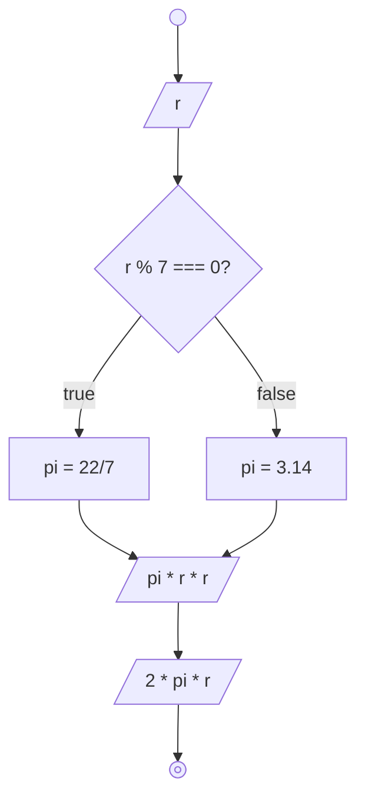

# Javascript 1

## Membuat Program Hitung Luas dan Keliling Lingkaran

### Flowchart

```mermaid
flowchart TD
    Start@{ shape: start }
    Input@{ shape: lean-r, label: "r" }
    RCheck@{ shape: decision, label: "r % 7 === 0?" }
    PiFr@{ shape: rect, label: "pi = 22/7" }
    PiDec@{ shape: rect, label: "pi = 3.14" }
    OutputArea@{ shape: lean-r, label: "pi * r * r" }
    OutputCircum@{ shape: lean-r, label: "2 * pi * r"}
    End@{ shape: stop }

    Start --> Input --> RCheck
    
    RCheck --true--> PiFr --> OutputArea
    RCheck --false--> PiDec --> OutputArea

    OutputArea --> OutputCircum --> End
```
